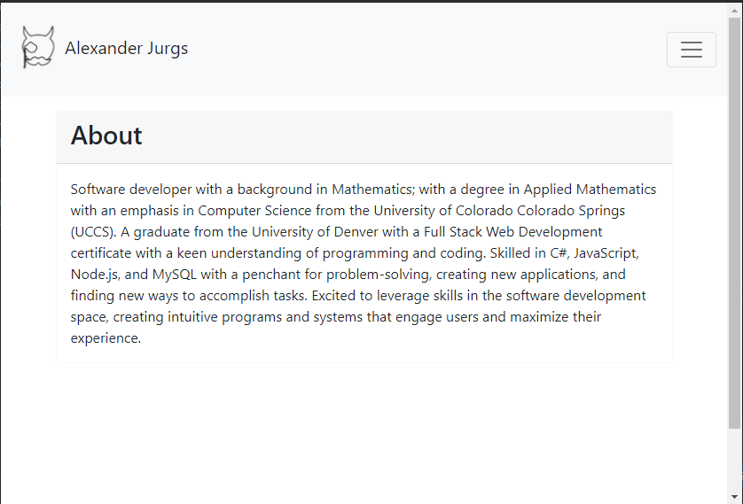

# React_Portfolo

This is my portfolio built with react. 

it was a challenge to transfer the custom css so i went with bootstrap. i found the project a little tedious but it did help me learn react.

## Installation

No Installation needed. the site is live at [https://ajurgs.github.io/React_Portfolio/](https://ajurgs.github.io/React_Portfolio/)

##  Usage

this is a portfolio site to display my work

## Credits 

I worked on this with my tutor Brian Lee.